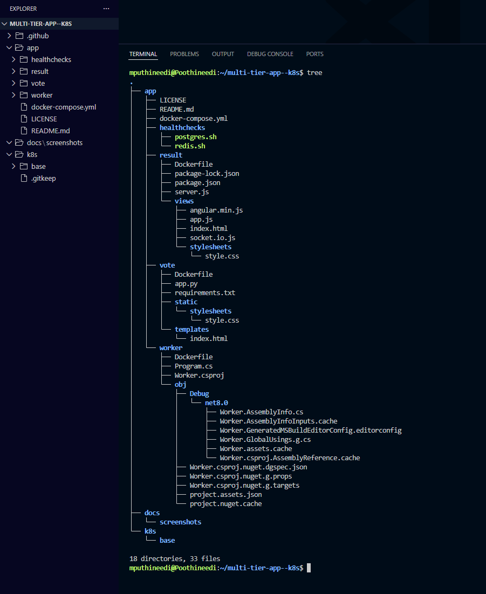
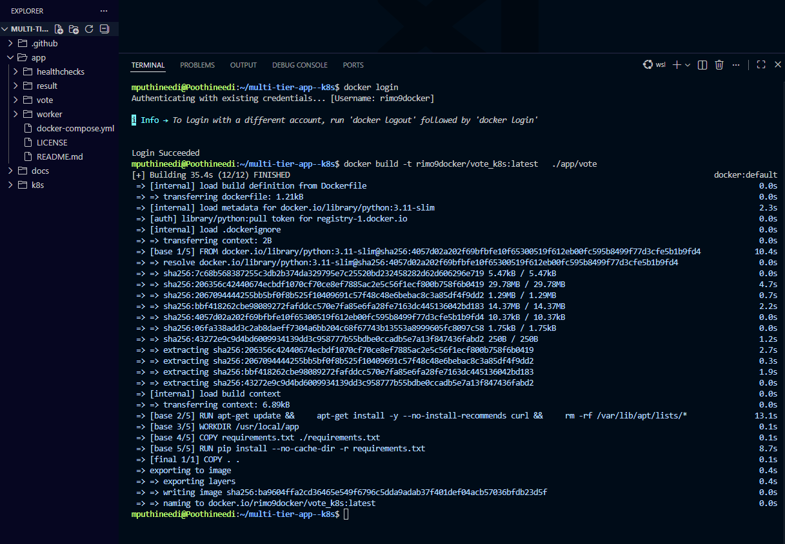
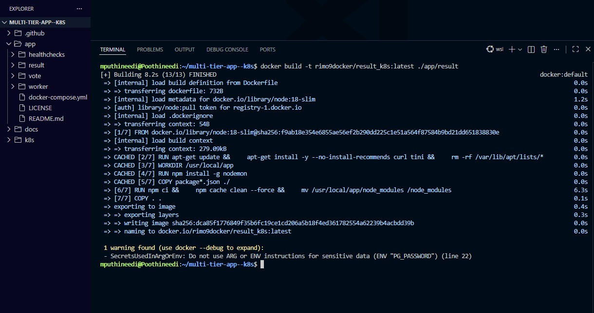
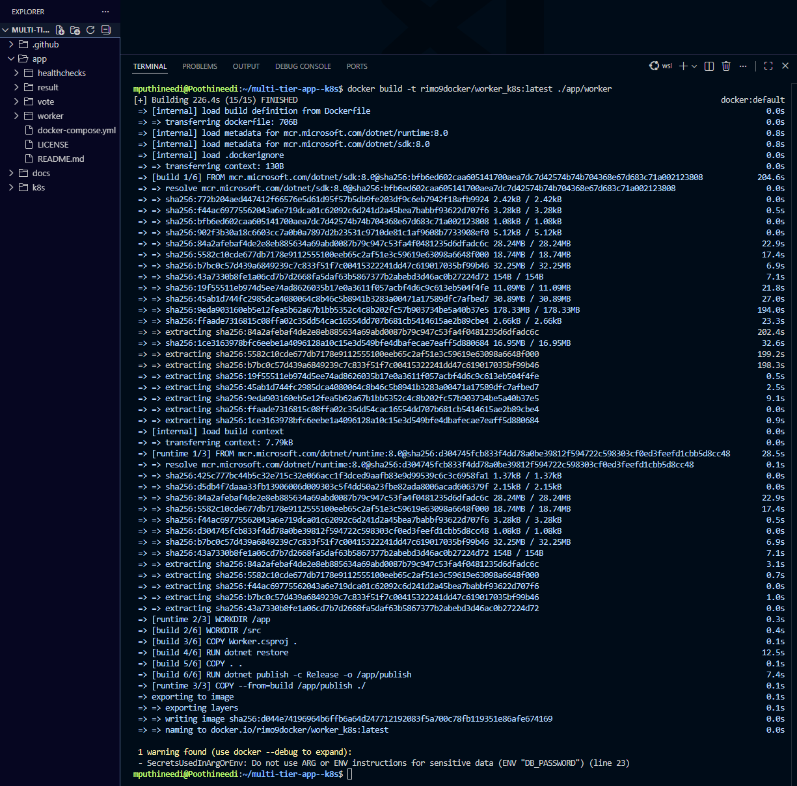
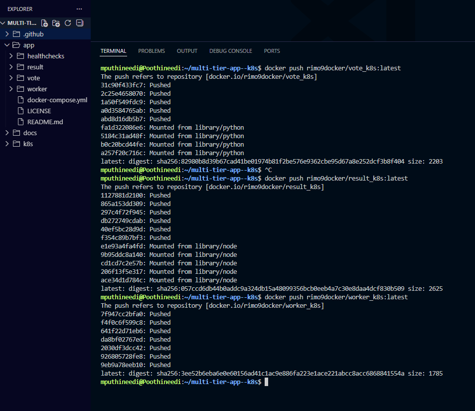

# Docker Setup

This document explains how Docker images for the **Multi-Tier Voting Application** were built and pushed to Docker Hub.

Docker images were created for the following services:

- **Vote service**
- **Result service**
- **Worker service**

All images were pushed to Docker Hub under the user **rimo9docker**.

---

## Step 1 — Verify Project Directory Structure

## Step Explanation

Before building Docker images, verify that the repository structure is correct and that each service directory contains the required Dockerfile.

```bash
tree
```



---

## Step 2 — Login to Docker Hub

Authenticate Docker with Docker Hub so that images can be pushed to the registry using the **rimo9docker** account.

```bash
docker login
```



---

## Step 3 — Build Vote Service Image

Build the Docker image for the **Vote service** using the Dockerfile located in the `app/vote` directory.
The image is tagged as **rimo9docker/vote_k8s:latest**.

```bash
docker build -t rimo9docker/vote_k8s:latest ./app/vote
```



---

## Step 4 — Build Result Service Image

Build the Docker image for the **Result service** using the Dockerfile located in the `app/result` directory.
The image is tagged as **rimo9docker/result_k8s:latest**.

```bash
docker build -t rimo9docker/result_k8s:latest ./app/result
```



---

## Step 5 — Build Worker Service Image

Build the Docker image for the **Worker service** using the Dockerfile located in the `app/worker` directory.
The image is tagged as **rimo9docker/worker_k8s:latest**.

```bash
docker build -t rimo9docker/worker_k8s:latest ./app/worker
```


---

## Step 6 — Push Images to Docker Hub

After successfully building the images, push them to Docker Hub so they can later be pulled by Kubernetes deployments.

```bash
docker push rimo9docker/vote_k8s:latest
docker push rimo9docker/result_k8s:latest
docker push rimo9docker/worker_k8s:latest
```


