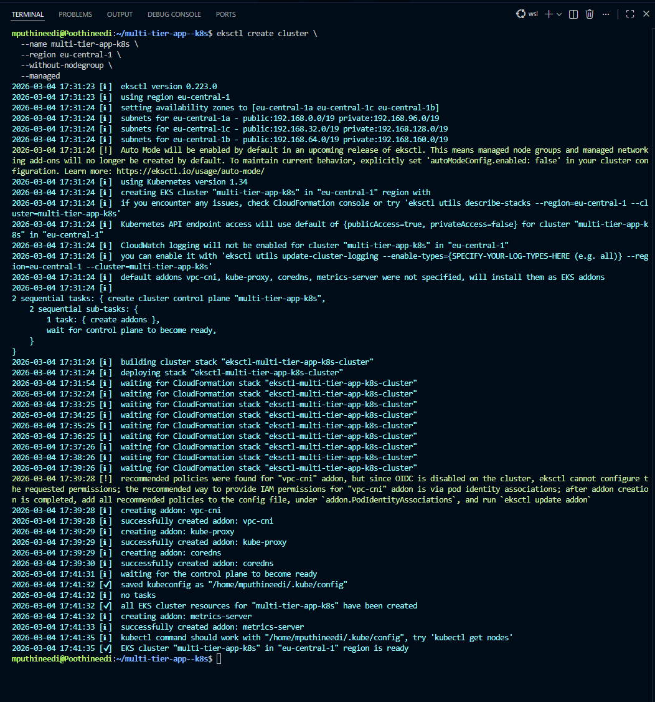
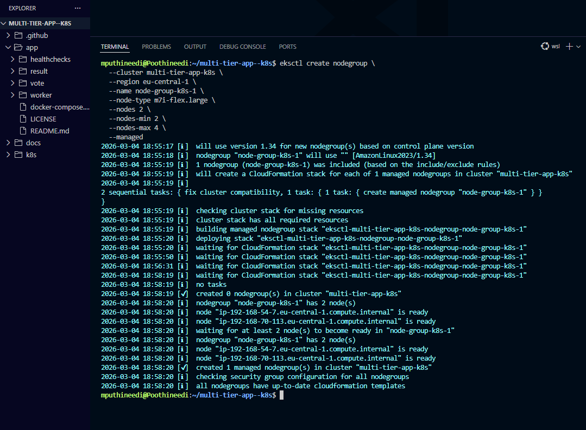
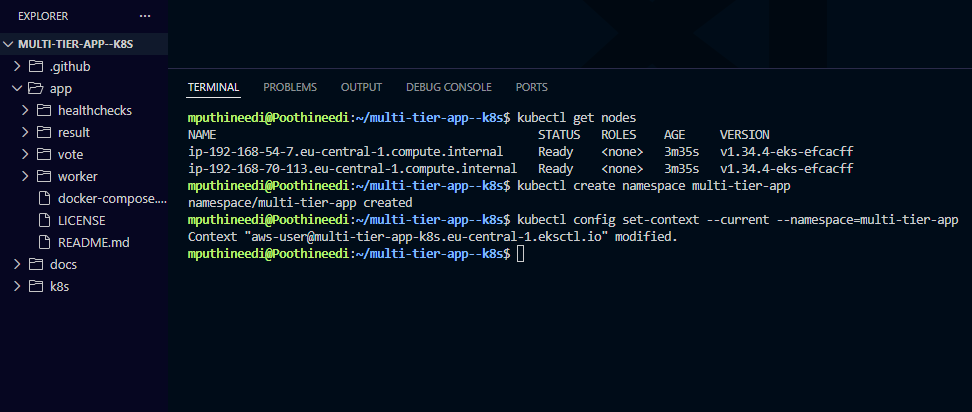

# EKS Cluster Setup

This document explains how the **Amazon EKS cluster** for the **Multi-Tier Voting Application** was created using `eksctl`, and how worker nodes were provisioned and verified.

---

## Step 1 — Create EKS Cluster (Control Plane)

### Step Explanation

Create an EKS cluster control plane in the **eu-central-1** region **without a node group** (nodes will be created in the next step). This also generates/updates the kubeconfig file for cluster access.

```bash
eksctl create cluster \
  --name multi-tier-app-k8s \
  --region eu-central-1 \
  --without-nodegroup \
  --managed
```



---

## Step 2 — Create Managed Node Group

Provision a managed node group for the cluster so Kubernetes workloads can be scheduled on worker nodes.
This configuration creates 2 nodes initially and allows autoscaling up to 4 nodes

```bash
eksctl create nodegroup \
  --cluster multi-tier-app-k8s \
  --region eu-central-1 \
  --name node-group-k8s-1 \
  --node-type m7i-flex.large \
  --nodes 2 \
  --nodes-min 2 \
  --nodes-max 4 \
  --managed
```



---

## Step 3 — Verify Nodes

Verify that the worker nodes successfully joined the cluster and are in Ready state

```bash
kubectl get nodes
```



---
