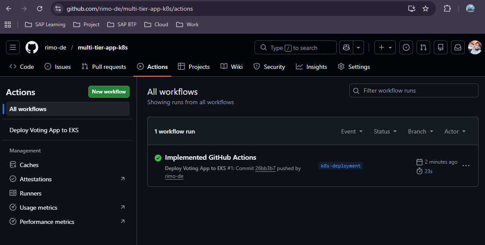

# GitHub Actions CI/CD Pipeline

This document explains how **GitHub Actions** was configured to automatically deploy the **Multi-Tier Voting Application** to **Amazon EKS** whenever code changes are pushed to the repository.

The workflow performs the following tasks:

- Authenticate with AWS
- Configure kubectl
- Update kubeconfig for the EKS cluster
- Deploy Kubernetes manifests automatically

The pipeline is triggered on **every push to the `k8s-deployment` branch**.

---

## Step 1 — Configure GitHub Repository Secrets

To allow GitHub Actions to authenticate with AWS securely, **AWS credentials are stored as encrypted repository secrets**.

The following secrets were added in the repository settings:

| Secret Name             | Description                           |
| ----------------------- | ------------------------------------- |
| `AWS_ACCESS_KEY_ID`     | IAM access key used by GitHub Actions |
| `AWS_SECRET_ACCESS_KEY` | IAM secret key for AWS authentication |

These secrets allow the GitHub workflow to securely interact with AWS services such as **EKS**.

## GitHub Secrets Configuration

Navigate to:

```bash
Repository → Settings → Secrets and variables → Actions
```

Then add the required AWS credentials as **Repository Secrets**.



---

## Step 2 — Configure GitHub Actions Workflow

A GitHub Actions workflow was created to automate deployment of the Kubernetes manifests to the EKS cluster.

The workflow performs the following steps:

1. Checkout the repository code
2. Configure AWS credentials
3. Install `kubectl`
4. Update kubeconfig for the EKS cluster
5. Deploy Kubernetes manifests

The workflow runs automatically **whenever changes are pushed to the `k8s-deployment` branch**. The pipeline runs successfully for each push and deploys the application updates to the EKS cluster.


---

## Step 3 — Verify Deployment Execution

## Step Explanation

Each workflow execution shows the detailed steps performed during the deployment process.

Successful pipeline execution includes the following stages:

- Setup job environment
- Checkout repository code
- Configure AWS credentials
- Install kubectl
- Update kubeconfig
- Deploy Kubernetes manifests

If all steps complete successfully, the application is automatically updated in the EKS cluster.

## Deployment Job Logs


---
