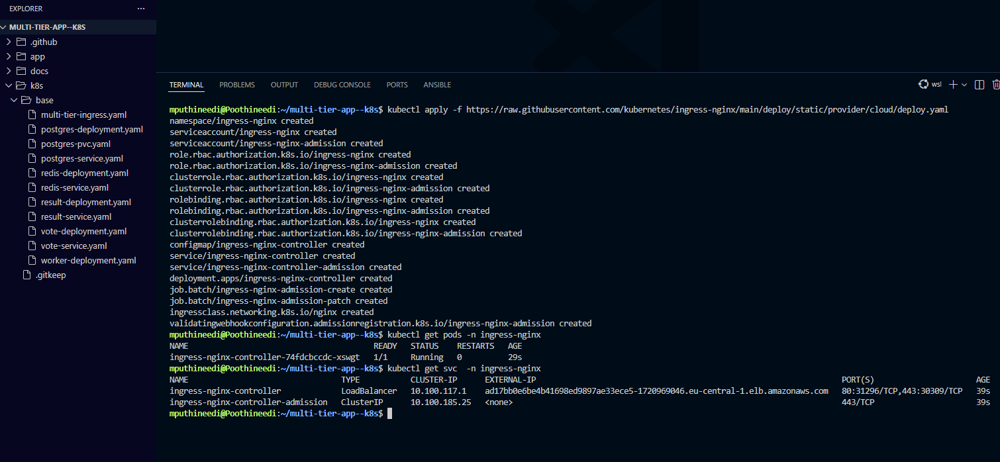
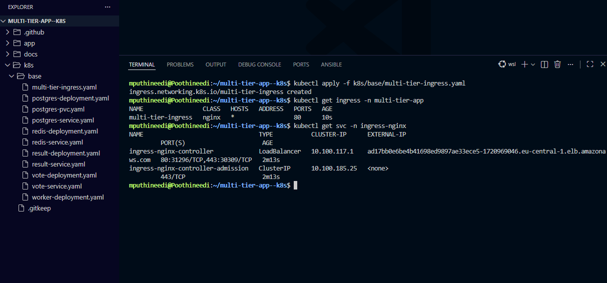
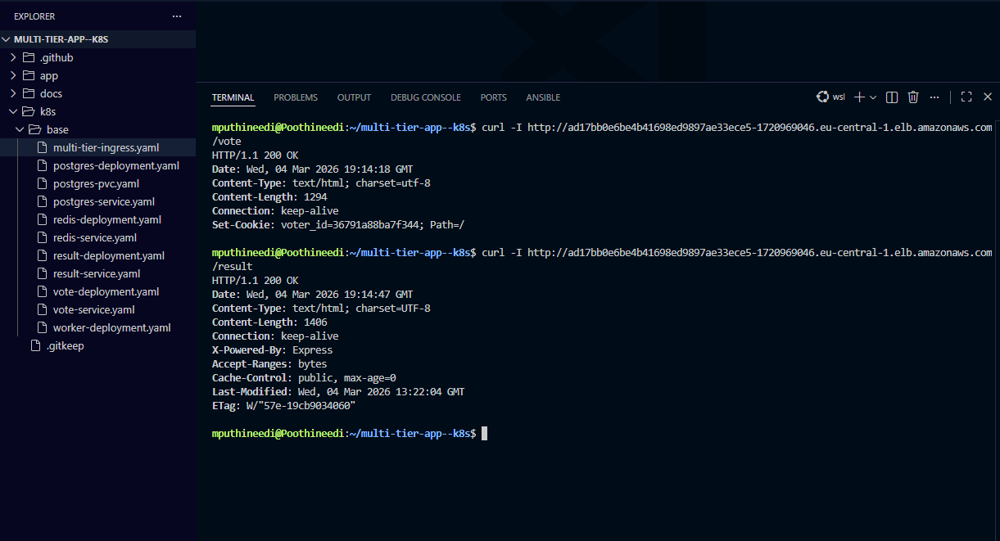

# Kubernetes Ingress Setup

This document explains how the **NGINX Ingress Controller** was installed and configured to expose the **Multi-Tier Voting Application** running on Amazon EKS.

The ingress controller routes external traffic to the internal Kubernetes services such as:

- **Vote Application**
- **Result Application**

---

## Step 1 — Install NGINX Ingress Controller

Install the **NGINX Ingress Controller** in the cluster using the official Kubernetes deployment manifest.
This controller manages incoming HTTP/HTTPS traffic and forwards it to the appropriate services inside the cluster.

The deployment automatically creates the required resources:

- Namespace
- Service Account
- RBAC roles
- Controller Deployment
- LoadBalancer Service

## Install Ingress Controller

```bash
kubectl apply -f https://raw.githubusercontent.com/kubernetes/ingress-nginx/main/deploy/static/provider/cloud/deploy.yaml
```

Verify Controller Deployment

```bash
kubectl get pods -n ingress-nginx
kubectl get svc -n ingress-nginx
```



---

## Step 2 — Apply Application Ingress Configuration

The multi-tier-ingress.yaml file defines routing rules for the application. The ingress configuration routes:

| Path    | Service            |
| ------- | ------------------ |
| /vote   | Vote Application   |
| /result | Result Application |

This allows external users to access the applications through a single LoadBalancer endpoint.

Apply Ingress Resource

````bash
kubectl apply -f k8s/base/multi-tier-ingress.yaml
```

Verify Ingress Resource

```bash
kubectl get ingress -n multi-tier-app
kubectl get svc -n ingress-nginx
````



---

## Step 3 — Verify Public Access via LoadBalancer DNS

When the ingress controller is deployed, Kubernetes automatically provisions an AWS Elastic Load Balancer (ELB). The public DNS name of this LoadBalancer can be used to access the application externally.

Test the endpoints using curl or a browser.

Test Vote and Result Endpoints

```bash
curl -I http://<LOAD_BALANCER_DNS>/vote
curl -I http://<LOAD_BALANCER_DNS>/result
```

A successful response should return:

```bash
HTTP/1.1 200 OK
```

indicating that the ingress controller correctly routes requests to the application services.



---
