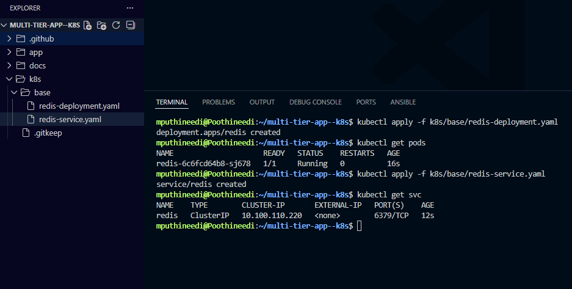
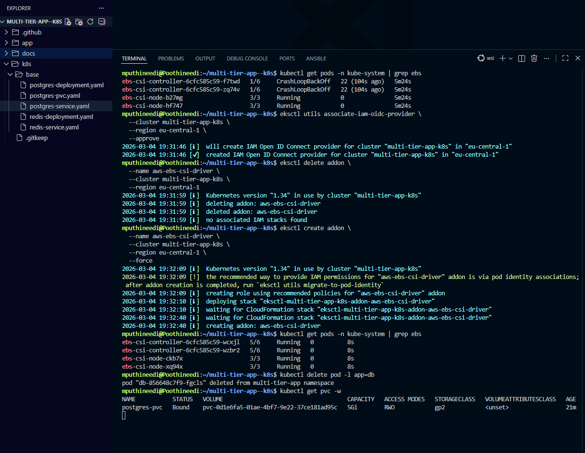
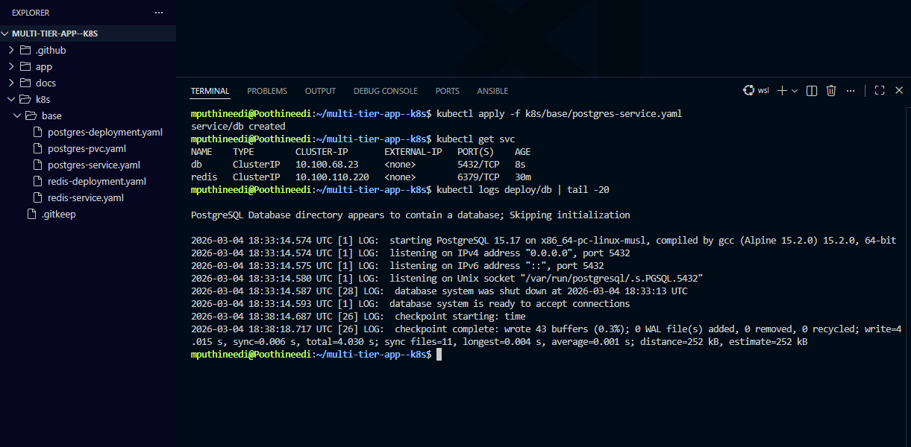
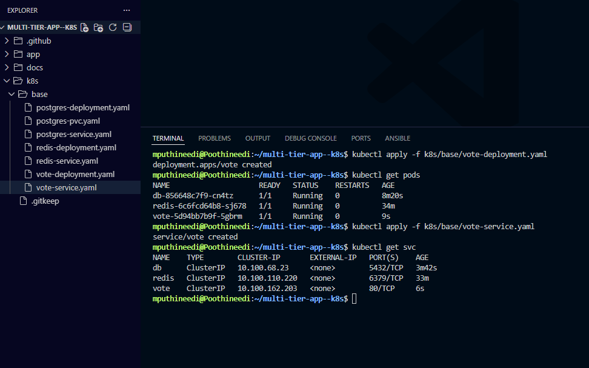
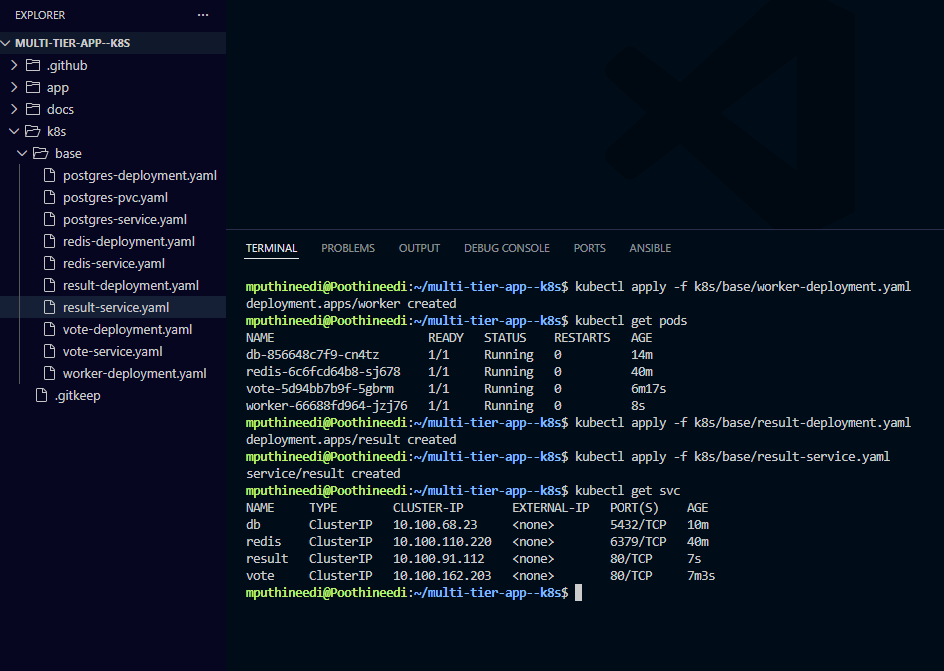
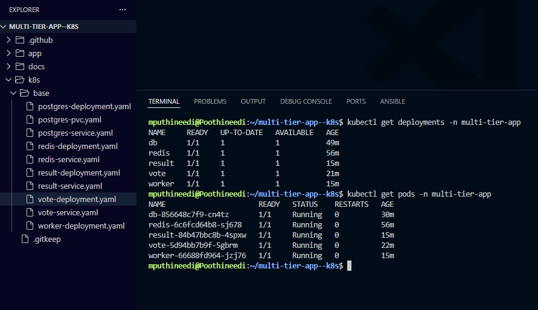

# Kubernetes Deployments

This document describes how the **Multi-Tier Voting Application** components were deployed to the **Amazon EKS cluster** using Kubernetes manifests.

The application consists of the following components:

- **Redis** – in-memory datastore for vote queue
- **PostgreSQL** – persistent database for results
- **Vote Application** – front-end voting interface
- **Worker Service** – processes votes from Redis and stores them in PostgreSQL
- **Result Application** – displays voting results

All Kubernetes manifests are located in the **k8s/base** directory.

---

## Step 1 — Deploy Redis (Deployment + Service)

Redis acts as the **message queue** for the voting application.  
Votes submitted by users are temporarily stored in Redis before being processed by the worker service.

First, deploy the Redis pod using a **Deployment**, then expose it internally using a **ClusterIP Service**.

```bash
kubectl apply -f k8s/base/redis-deployment.yaml
kubectl apply -f k8s/base/redis-service.yaml
```

Verify Redis Deployment

```bash
kubectl get pods
kubectl get svc
```





---

## Step 2 — Deploy PostgreSQL (Persistent Database)

PostgreSQL stores the final vote results. A Persistent Volume Claim (PVC) is used to ensure the database data persists even if the pod restarts.

The following resources are created:

- Persistent Volume Claim
- PostgreSQL Deployment
- PostgreSQL Service

Deploy PostgreSQL

```bash
kubectl apply -f k8s/base/postgres-pvc.yaml
kubectl apply -f k8s/base/postgres-deployment.yaml
kubectl apply -f k8s/base/postgres-service.yaml
```

Verify PostgreSQL

```bash
kubectl get pvc
kubectl get pods
kubectl get svc
```



---

## Step 3 — Deploy Vote Application (Frontend)

The Vote application provides the web interface where users can cast their votes.
The application communicates with Redis to store votes. The deployment creates the frontend pods and exposes them internally using a ClusterIP service.

Deploy Vote Application

````bash
kubectl apply -f k8s/base/vote-deployment.yaml
kubectl apply -f k8s/base/vote-service.yaml
```

Verify Vote Application

```bash
kubectl get pods
kubectl get svc
````



---

## Step 4 — Deploy Worker and Result Applications

The remaining services complete the voting workflow.

- Worker Service: The worker continuously reads votes from Redis and writes them to PostgreSQL.
- Result Application : The result service displays voting results stored in the PostgreSQL database.

Both services are deployed as Kubernetes Deployments and exposed internally using ClusterIP services.

Deploy Worker and Result Services

```bash
kubectl apply -f k8s/base/worker-deployment.yaml
kubectl apply -f k8s/base/result-deployment.yaml
kubectl apply -f k8s/base/result-service.yaml
```

Verify Application Components

```bash
kubectl get deployments -n multi-tier-app
kubectl get pods -n multi-tier-app
```



---

## Final Verification

After deploying all components, verify that all services and pods are running correctly.

```bash
kubectl get deployments
kubectl get pods
kubectl get svc
```



---
